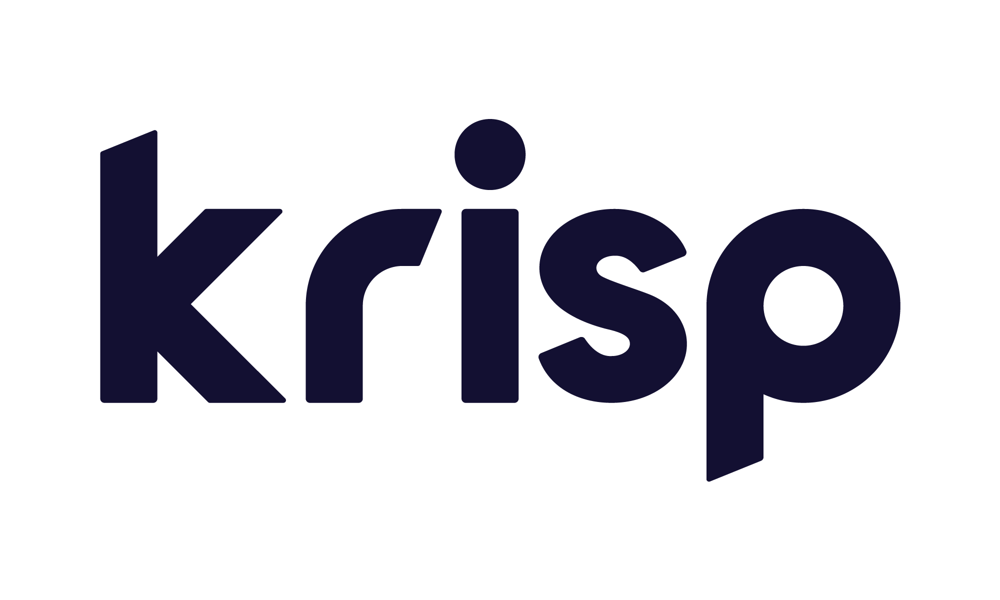

<div align="right">

</div>

# Krisp Sample Apps
## Overview
The repository provides sample apps for all desktop platforms demonstrating Krisp SDK functionality.
The build system and the codebase is compatible with.
* Mac M1
* Mac Intel
* Windows(amd64)
* Linux(amd64)

## Build Dependencies
The reference samples require
* **libsndfile** library to read and write WAV files
* Krisp SDK package with archive libraries for the noise canceling and speech to text.

The following environment variables are mandatory. The name of each parameter is self-explanatory.
* KRISP_SDK_PATH
* LIBSNDFILE_INC
* LIBSNDFILE_LIB

KRISP_SDK_PATH should point to the Krisp SDK package directory.

LIBSNDFILE_INC and LIBSNDFILE_LIB directories is required by the sample-nc app for the purpose of reading and writing WAV PCM-based audio files. It is not the SDK requirement.


## Build Process

How to run the build

### On Mac/Linux run

For Krisp NC SDK
```make```

For Krisp NC and STT SDK
```make stt```

### On Windows
For Krisp NC SDK run
```build-vs-solution.bat```

Open the Visual Studio Solution located in the ```vs-solution``` folder and manually build the target apps.


For Krisp NC and STT SDK run
```build-vs-solution-stt.bat```

Open the Visual Studio Solution located in the ```vs-solution``` folder and manually build the target apps.


This will produce a Visual Studio Solution project in the **vsbuild** folder.

## Build Output
All apps will be stored inside the **bin** folder in the root directory

# Apps
## sample-nc
The noise cancelling app that applies Krisp NC technology on the given PCM16 wav file using given Krisp Weight file model. The app with its codebase demonstrates 
* how to initialize Krisp SDK and how to free memory resources if you don't need to use Krisp anymore 
* how to load a single model
* how to define the size of the frame to prepare the SDK for the processing of the frame sequence
* how to process the sound frame-by-frame using Krisp
* how to process either PCM16 or FLOAT based audio file
* how to use either regular Krisp NC API or NC API with Call Stats
* how to to get the Call Stats for the whole processed file and for the each frame, the feature is enabled with '-s' option

### Usage
```sample-nc -i <PCM16 or FLOAT32 wav file> -o <output WAV file path> -m <path to the AI model> -s```

### Test input for the sample-nc app
[test/input/sample-nc-test.wav](test/input/sample-nc-test.wav)

## libkrispdll with dll-test-app

### Description
The sample demonstrates how to build dynamic link library using Krisp static libraries.

#### Where it should be useful
Dynamic link libraries for Linux are always bound to specific GLIBC version. It means that you will not be able to use them on older Linux systems. This samples can be used to build DLL libraries for old Linux systems using Krisp static libraries.

## sample-stt
Sample app that demonstrates how to link to the Krisp SDK version 8 static libraries and use the Krisp ASR API to process PCM16 or FLOAT32 wav file to text.

### Usage
```sample-stt -i <PCM16 or FLOAT32 wav file> -o <output directory> -m <path to the ASR AI model>```
