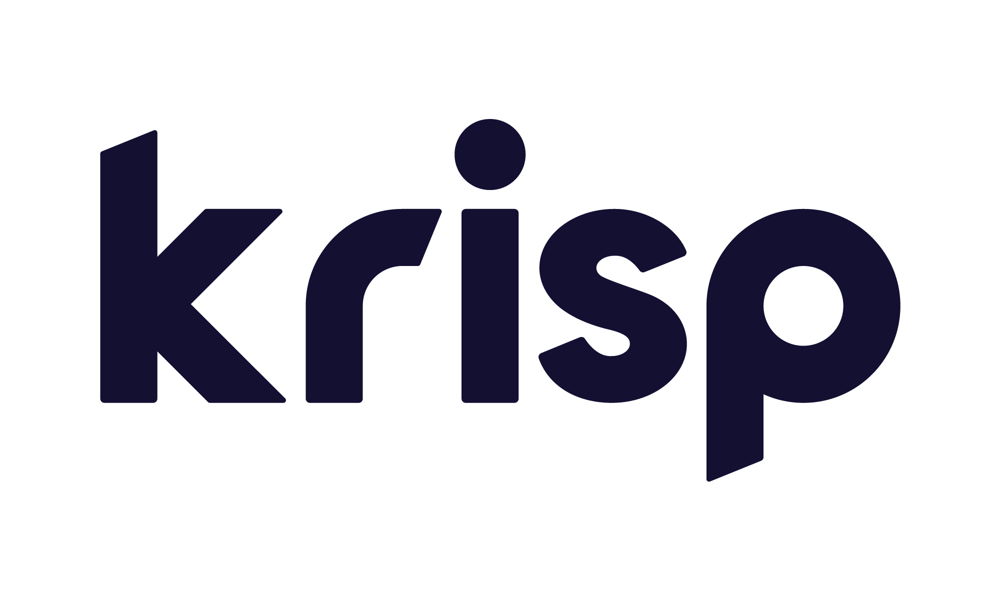

<div align="right">

</div>

# Krisp SDK Sample Apps
## Overview
This repository contains sample applications for desktop platforms that demonstrate the Krisp Audio SDK.
The build system and codebase are compatible with Krisp SDK Desktop/Server v9.9 or later on:
* Linux (x64, arm64) with GCC 9.4+
* macOS (x64, arm64) with Clang 15+
* Windows (x64, arm64) with Visual Studio 2019+

The build system uses CMake.


## Sample Apps

* sample-nc: CLI WAV denoiser using Krisp NC (PCM16/FLOAT32, optional stats)
* sample-vad: Voice Activity Detection; writes per-frame VAD scores to a text file
* krisp-wav-cli: CLI WAV processor using Krisp NC; optional Accent when enabled
* sample-dll: Builds a dynamic library (`libkrispdll`) and a minimal test app
* sample-node: Node.js addon and sample app that processes WAV via N-API using Krisp C++ SDK
* sample-python: CPython module and script that processes WAV via pybind11 using Krisp C++ SDK

## Third-party Dependencies per App

| App | CMake option | 3rd-party dependencies | Notes |
| --- | --- | --- | --- |
| bin/sample-nc | `-DBUILD_SAMPLE_NC=ON` | `libsndfile` (set `LIBSNDFILE_INC`, `LIBSNDFILE_LIB`) | WAV I/O |
| bin/sample-vad | `-DBUILD_SAMPLE_VAD=ON` | `libsndfile` (set `LIBSNDFILE_INC`, `LIBSNDFILE_LIB`) | Writes VAD scores |
| bin/krisp-wav-cli | `-DBUILD_WAV_CLI=ON` | None | Accent support with `-DENABLE_ACCENT=ON` |
| bin/sample-node | `-DBUILD_SAMPLE_NODEJS=ON` | Node v20+, N-API 9, `NODE_INC`, `node-addon-api` (npm) | Runs `npm install` |
| bin/sample-python | `-DBUILD_SAMPLE_PYTHON=ON` | Python3 Dev + NumPy, `pybind11` | Builds `krisp_module` |
| bin/sample-dll | N/A (VS solution) | none | Built via `vs-solution` |

## Using CMake

### Options

- `-DCOPY_KRISP_SDK=<path>`: Copy SDK into the `krisp-sdk/` folder. Use this once.
- `-DBUILD_SAMPLE_NC=ON|OFF`: Build `bin/sample-nc`.
- `-DBUILD_WAV_CLI=ON|OFF`: Build `bin/krisp-wav-cli` (from `src/wav-cli`).
- `-DBUILD_SAMPLE_VAD=ON|OFF`: Build `bin/sample-vad`.
- `-DBUILD_SAMPLE_NODEJS=ON|OFF`: Build Node.js addon (`NODE_INC` required).
- `-DBUILD_SAMPLE_PYTHON=ON|OFF`: Build CPython module (pybind11 + Python/NumPy required).
- `-DENABLE_ACCENT=ON|OFF`: Enable Accent API (affects `krisp-wav-cli`).
- `-DLIBSNDFILE_INC=<dir>`: Path to libsndfile headers.
- `-DLIBSNDFILE_LIB=<dir>`: Path to libsndfile libraries.
- `-DNODE_INC=<dir>`: Path to Node headers (for Node.js addon).
- `-DPYTHON3_PATH=<path>`: Python executable path (optional).

### Configure and build

### Configure and build examples

#### Schema
```
cmake -S cmake -B build [options]
cmake --build build -j
```

#### Build `bin/sample-nc`
```
cmake -DBUILD_SAMPLE_NC=ON -B build -S cmake -DCOPY_KRISP_SDK=/home/atatalyan/dev/krisp-sdk/krisp-audio-sdk-9.9.0-server-lin_x64 -DLIBSNDFILE_INC=/usr/include -DLIBSNDFILE_LIB=/usr/lib/x86_64-linux-gnu
cd build
make
```

#### Build `bin/krisp-wav-cli`
```
cmake -DBUILD_WAV_CLI=ON -DENABLE_ACCENT=OFF -DCOPY_KRISP_SDK=/home/atatalyan/dev/krisp-sdk/krisp-audio-sdk-9.9.0-server-lin_x64 -B build -S cmake
cd build 
make
```

### Troubleshooting
#### Error Krisp SDK already exists
```
CMake Error at CMakeLists.txt:55 (message):
  Krisp SDK already exists at:
  /home/atatalyan/dev/repos/Krisp-SDK-Sample-Apps/native-cpp/krisp-sdk
```
With the `DCOPY_KRISP_SDK` option cmake will try to copy Krisp SDK to the `native-cpp/krisp-sdk` folder.

**Fixing Options**
- Don't use the DCOPY_KRISP_SDK option to use the existing Krisp SDK version stored in the krisp-sdk folder
- Remove the krisp-sdk folder to copy a new version of the SDK.

### Installing libsndfile (macOS)
```brew install libsndfile```

## CPython Module Dependencies
In addition to the above, you need **pybind11** and **NumPy** to build the CPython module.

### On Ubuntu Linux
```sudo apt-get install pybind11-dev```

```pip3 install numpy```

### On Mac
```brew install pybind11```

```pip3 install numpy```

## Node.js Module Dependencies
Node v20 or later. N-API version 9.
You also need npm dependencies defined in `src/sample-node/package.json`.

The `NODE_INC` environment variable should point to the installed Node headers.

On ARM based Mac with Homebrew the path could be ```/opt/homebrew/include/node```

On Ubuntu Linux with nvm it could be the ```$HOME/.nvm/versions/node/v22.9.0/include/node```
if installed locally.

## Build Output
All apps will be stored inside the **bin** folder in the root directory

# Using Apps
## sample-nc
The noise-cancelling app that applies Krisp NC on a PCM16/FLOAT32 WAV file using the provided model. The app demonstrates
* how to initialize Krisp SDK and how to free memory resources if you don't need to use Krisp anymore
* how to load a single model
* how to define the size of the frame to prepare the SDK for the processing of the frame sequence
* how to process the sound frame-by-frame using Krisp
* how to process either PCM16, PCM32 or PCM FLOAT-based audio file
* how to use either the regular Krisp NC API or the NC API with Call Stats
* how to get the Call Stats for the whole processed file and for each frame (enable with `-s`)

### Usage
```sample-nc -i <PCM16 or FLOAT32 wav file> -o <output WAV file path> -m <path to the AI model> -s```

### Test input for the sample-nc app
[test/input/sample-nc-test.wav](test/input/sample-nc-test.wav)
## CPython Sample
The sample imitates realtime PCM16 audio stream by reading PCM16 WAV file.
It uses CPython based wrapper over Krisp Audio SDK to process audio data.
The processed output is stored in the WAV file.

```python3 process_wav.py -i <PCM16 wav file> -o <output WAV file path> -m <path to the AI model>```

## Node Module
The sample imitates realtime PCM16 or FLOAT32 audio stream by reading PCM16/FLOAT32 WAV file.
It uses Node based wrapper over Krisp Audio SDK to process audio data.  The processed output is
stored in the WAV file.

```cd src/sample-node```

```node index.js -i <PCM16 wav file> -o <output WAV file path> -m <path to the AI model>```

## libkrispdll with dll-test-app

### Description
The sample demonstrates how to build dynamic link library using Krisp static libraries.

#### Where it should be useful
Dynamic libraries on Linux are bound to a specific GLIBC version, so newer builds may not run on older systems. This sample shows how to build a DLL using Krisp static libraries for broader compatibility.